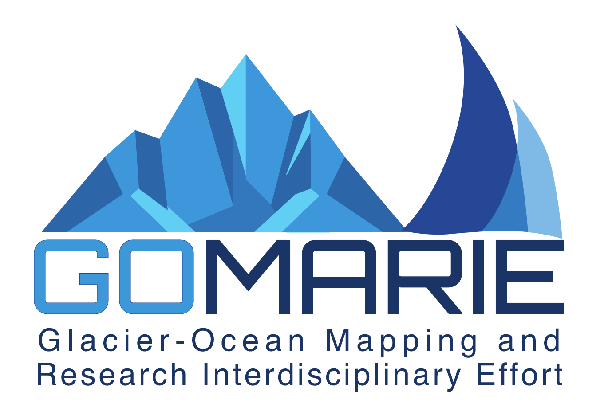

# Data Collection for GO-MARIE 2022
Bathymetry for Science onboard the R/V Marie Tharp (more information at the [expedition page](https://www.oceanresearchproject.org/go-marie/)).

<p align="center">
  
</p>

## Install Python libraries

```bash
pip install absl-py pyserial colorama
```